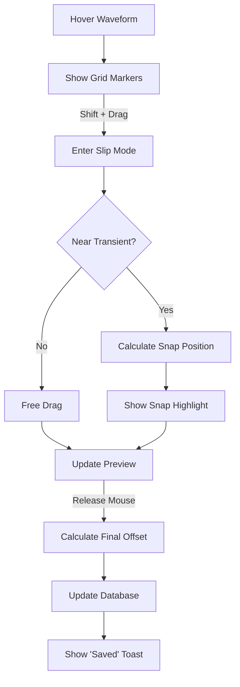

# Story 2.3: "Slip-Under" Beatgrid Editing

Status: in-progress

## Story

As a user,
I want to surgically adjust the beatgrid by moving the audio waveform under a fixed grid marker,
So that I can ensure 100% accurate sync for tracks with complex transients.

## Acceptance Criteria

1. **Slip Mode Activation:** Given the WebGL waveform from Story 2.1, when I hover over the waveform and use `Shift + Drag`, then the system must enter "Slip Mode" where the waveform follows the mouse 1:1 while the playhead/grid remains static. [Source: epics.md#Story 2.3]

2. **Magnetic Snap Feedback:** The system must show "Magnetic Snap" visual feedback when a transient (detected peak) aligns with a grid marker within a configurable threshold (default: 10ms). [Source: epics.md#Story 2.3, ux-design-specification.md#Novel UX Patterns]

3. **Real-time Grid Visualization:** The beatgrid markers must be rendered on the waveform view using the beat anchor positions from the `beatData` binary blob stored in Story 2.2. [Source: epics.md#Story 2.3]

4. **Database Persistence:** Upon mouse release, the system must update the `beatData` binary blob in the `PerformanceData` table (type=3) with the new sample offset and persist immediately. [Source: epics.md#Story 2.3, engine-dj-schema.sql]

5. **Save Confirmation:** The system must show a brief "Saved" toast notification to confirm the database write was successful. [Source: epics.md#Story 2.3, ux-design-specification.md#Micro-Emotions]

6. **Keyboard Nudge:** Support `Shift + Left/Right` arrow keys to nudge the beatgrid by 1ms increments for fine-tuning without mouse interaction. [Source: ux-design-specification.md#Accessibility Implementation]

## Tasks / Subtasks

- [x] **Task 1: Beatgrid Rendering on Waveform** (AC: 3)
  - [x] Create `BeatgridOverlay.tsx` component to render beat markers
  - [x] Load and deserialize beatgrid data from PerformanceData table
  - [x] Calculate pixel positions for each beat based on view range
  - [x] Render vertical lines at each beat position (subtle gray for normal, Engine Green for downbeats)
  - [x] Integrate overlay with WaveformDetail component

- [x] **Task 2: Slip Mode Interaction** (AC: 1)
  - [x] Detect Shift+Drag combination on waveform component
  - [x] Implement slip mode state management in audio store
  - [x] Calculate sample offset from mouse delta (pixels → samples conversion)
  - [x] Move waveform visually while keeping center playhead/grid static
  - [x] Add visual indicator for "SLIP" mode active state
  - [x] Handle Shift key release to cancel slip without saving

- [x] **Task 3: Transient Detection for Snap** (AC: 2)
  - [x] Implement peak detection algorithm on waveform data
  - [x] Create `findNearestTransient(samplePosition, threshold)` utility
  - [x] Store transient positions for quick lookup during drag
  - [x] Configure snap threshold (default 10ms = ~441 samples at 44.1kHz)

- [x] **Task 4: Magnetic Snap Feedback** (AC: 2)
  - [x] Detect when dragged position aligns with a grid marker (within threshold)
  - [x] Show "Engine Green" highlight on snapped grid line
  - [x] Add subtle "pulse" animation when snap occurs
  - [ ] Optional: audio click feedback when snapping (skipped)

- [x] **Task 5: Database Update on Release** (AC: 4, 5)
  - [x] Calculate new `firstBeatSample` offset from slip amount
  - [x] Update all anchor positions with the offset delta
  - [x] Re-serialize beatgrid using existing `serializeBeatgrid()` function
  - [x] Call `analysisService.updateBeatgridOffset()` to persist
  - [x] Update local store state immediately (optimistic update)

- [ ] **Task 6: Toast Notification System** (AC: 5)
  - [ ] Create `Toast.tsx` component (non-blocking notification)
  - [ ] Create `toast.store.ts` Zustand store for managing toast queue
  - [ ] Style toast with "Saved" green confirmation variant
  - [ ] Auto-dismiss after 2 seconds
  - [ ] Position in footer area per UX spec

- [ ] **Task 7: Keyboard Nudge Support** (AC: 6)
  - [ ] Listen for `Shift + Left/Right` arrow keys when waveform is focused
  - [ ] Nudge beatgrid by 1ms (±44 samples at 44.1kHz) per keypress
  - [ ] Debounce database writes during rapid key presses
  - [ ] Show "Saved" toast after debounce period ends

- [ ] **Task 8: Integration & Testing** (AC: all)
  - [ ] Add unit tests for offset calculation and serialization
  - [ ] Add unit tests for transient detection algorithm
  - [ ] Test slip mode visual behavior manually
  - [ ] Verify database persistence across page reload

## Dev Notes

### Critical Architecture Compliance

**Split-Brain Pattern (MANDATORY):**
- Beatgrid rendering and offset calculation can run on main thread (low-frequency UI operation)
- Database writes MUST go through the kernel message bus to the database worker
- Do NOT perform heavy computation in drag event handlers (pre-calculate during load)

**Thread Boundaries:**
```
[Main Thread] --Load beatgrid--> [Database Worker] --deserialize--> [BeatgridOverlay]
[User Drag] --calculate offset--> [Main Thread] --BEATGRID_UPDATE--> [Database Worker]
[Database Worker] --persist--> [OPFS] --confirm--> [Main Thread] --show toast-->
```

### Previous Story Intelligence

**From Story 2.2 (Track Analysis):**
- `BeatgridData` interface already defined with `anchors[]` array of sample positions
- `serializeBeatgrid()` and `deserializeBeatgrid()` functions ready to use
- `analysisService.storeAnalysisResults()` can be used as reference for database updates
- Beatgrid stored in PerformanceData table with `type=3`

**Key learnings from 2.2 code review:**
- Analysis currently runs on main thread (documented deviation from Split-Brain)
- BeatgridData format: 13-byte header + 4 bytes per anchor
- Header: version(1) + bpm(4) + firstBeatSample(4) + beatCount(4)

**From Story 2.1 (Waveform Renderer):**
- `WaveformDetail` component handles zoomed view with playhead centering
- `viewRange` prop controls visible portion of waveform
- Click/drag interactions already implemented for seeking/browsing
- Must extend (not replace) existing interaction handlers

### Existing Code Integration Points

**Files to Modify:**
```
src/modules/audio/components/WaveformDetail.tsx  # Add slip mode interaction
src/modules/audio/services/analysis.service.ts   # Add updateBeatgridOffset method
src/modules/audio/store/audio.store.ts           # Add slip mode state if needed
```

**Files to Create:**
```
src/modules/audio/components/BeatgridOverlay.tsx  # Beat marker rendering
src/modules/audio/utils/transient-detector.ts     # Peak detection utility
src/shared/components/Toast.tsx                   # Toast notification component
src/shared/store/toast.store.ts                   # Toast state management
```

### Beatgrid Offset Calculation

```typescript
// Example: User drags waveform 100 pixels to the left
// This means they want the audio to "start earlier" relative to the grid
// So we need to INCREASE firstBeatSample by the sample equivalent of 100px

function calculateNewOffset(
  currentFirstBeat: number,
  dragDeltaPixels: number,
  pixelsPerSample: number
): number {
  const sampleDelta = dragDeltaPixels / pixelsPerSample;
  return Math.round(currentFirstBeat - sampleDelta);
}

// Update all anchors with the delta
function updateAnchors(anchors: number[], offsetDelta: number): number[] {
  return anchors.map(anchor => anchor + offsetDelta);
}
```

### Magnetic Snap Algorithm

```typescript
const SNAP_THRESHOLD_MS = 10; // 10 milliseconds
const SNAP_THRESHOLD_SAMPLES = Math.round(SNAP_THRESHOLD_MS * sampleRate / 1000);

function checkSnapToGrid(
  transientPosition: number,
  gridPositions: number[],
  threshold: number
): { snapped: boolean; gridPosition: number | null } {
  for (const gridPos of gridPositions) {
    if (Math.abs(transientPosition - gridPos) <= threshold) {
      return { snapped: true, gridPosition: gridPos };
    }
  }
  return { snapped: false, gridPosition: null };
}
```

### Toast Component Pattern

Follow existing UX patterns from the project:
- Non-blocking (no modal overlay)
- Position: bottom-right or footer area
- Auto-dismiss: 2-3 seconds
- Variants: success (green), error (red), info (blue)

```typescript
interface ToastMessage {
  id: string;
  message: string;
  variant: 'success' | 'error' | 'info';
  duration?: number;
}

// Usage after successful save:
toast.show({ message: 'Beatgrid saved', variant: 'success' });
```

### Database Schema Reference

**PerformanceData table (from engine-dj-schema.sql):**
```sql
-- type: 1=HotCue, 2=Loop, 3=Beatgrid, 4=Waveform
UPDATE PerformanceData
SET data = ?
WHERE trackId = ? AND type = 3;
```

### Visual Design Requirements

**From UX Design Specification:**
- Beatgrid lines: subtle gray (`#333`) for regular beats, Engine Green (`#4DFA90`) for downbeats (beat 1 of bar)
- Snap highlight: Engine Green with subtle glow/pulse
- Slip mode indicator: "SLIP" badge similar to existing "BROWSE" indicator
- Toast: Dark background (`#121212`) with Engine Green border for success

### Interaction Flow



### Performance Targets

- **Drag responsiveness:** <16ms frame time during slip mode
- **Snap detection:** Pre-calculate transient positions on load, O(1) lookup
- **Database write:** Async, should not block UI
- **Toast animation:** CSS-only, no JS animation during render

### Error Handling

```typescript
export type BeatgridEditError =
  | { type: 'NO_BEATGRID'; message: string }
  | { type: 'SAVE_FAILED'; message: string }
  | { type: 'INVALID_OFFSET'; message: string };
```

If track has no beatgrid, show disabled slip mode with tooltip "Run Track Analysis first".

### Git Commit Convention

Follow established patterns from recent commits:
- `feat(audio):` prefix for new audio module features
- `fix(audio):` for bug fixes
- Reference story number in commit body

### References

- [Source: _bmad-output/planning-artifacts/epics.md#Story 2.3]
- [Source: _bmad-output/planning-artifacts/ux-design-specification.md#Novel UX Patterns]
- [Source: _bmad-output/planning-artifacts/ux-design-specification.md#Grid Editing]
- [Source: _bmad-output/planning-artifacts/architecture.md#Split-Brain Actor Model]
- [Source: _bmad-output/implementation-artifacts/2-2-automated-track-analysis-bpm-key-grid.md]
- [Source: _bmad-output/implementation-artifacts/2-1-webgl-waveform-renderer.md]
- [Source: src/modules/audio/components/WaveformDetail.tsx]
- [Source: src/modules/audio/analysis/track-analyzer.ts#BeatgridData]
- [Source: src/modules/database/schema/engine-dj-schema.sql#PerformanceData]

## Dev Agent Record

### Agent Model Used

Claude Opus 4.5 (claude-opus-4-5-20251101)

### Debug Log References

### Completion Notes List

- **Task 1 (2026-01-16):** Implemented BeatgridOverlay component with `getVisibleBeats()` utility function for calculating beat positions within view range. Added beatgrid data to audio store (DeckState interface). Updated WaveformDetail to render beatgrid overlay. Modified deck-loader.service to load beatgrid from database when track is loaded. Added 11 unit tests for beat visibility and position calculations, all passing.

- **Task 2 (2026-01-16):** Implemented slip mode interaction with Shift+Drag detection. Added SlipModeState interface and actions to audio store (startSlipMode, updateSlipOffset, cancelSlipMode, commitSlipMode). Updated WaveformDetail with slip mode event handlers, samples-per-pixel conversion for offset calculation, and SLIP mode indicator. Added Shift key release detection to cancel slip. Wired slip callbacks in DeckUI to connect to store.

- **Task 3 (2026-01-16):** Implemented TransientDetector utility with peak detection algorithm. Created `detectTransients()` function that analyzes waveform peaks for local maxima above threshold. Created `findNearestTransient()` with O(log n) binary search lookup. Added TransientDetector class for cached transient analysis with configurable snap threshold (default 10ms = 441 samples). Added 22 unit tests, all passing.

- **Task 4 (2026-01-16):** Implemented magnetic snap feedback UI. Extended SlipModeState with snappedBeatIndex and isSnapped properties. Added setSnappedBeat action to audio store. Updated BeatgridOverlay with CSS pulse animation for snapped beats (beatgrid-snap-pulse keyframes). Added Engine Green glow effect (3px width, box-shadow) on snapped beats. Wired snappedBeatIndex through DeckUI to WaveformDetail to BeatgridOverlay.

- **Task 5 (2026-01-16):** Implemented database persistence for beatgrid edits. Added `updateBeatgridOffset()` method to AnalysisService that serializes beatgrid data and updates PerformanceData table. Updated DeckUI handleSlipCommit to calculate new beatgrid positions (offset applied to firstBeatSample and all anchors), perform optimistic store update, then async persist to database.

### Change Log

- 2026-01-16: Task 1 - Beatgrid Rendering on Waveform completed
- 2026-01-16: Task 2 - Slip Mode Interaction completed
- 2026-01-16: Task 3 - Transient Detection for Snap completed
- 2026-01-16: Task 4 - Magnetic Snap Feedback completed
- 2026-01-16: Task 5 - Database Update on Release completed

### File List

**Created:**
- src/modules/audio/components/BeatgridOverlay.tsx
- src/modules/audio/components/BeatgridOverlay.test.ts
- src/modules/audio/utils/transient-detector.ts
- src/modules/audio/utils/transient-detector.test.ts

**Modified:**
- src/modules/audio/components/WaveformDetail.tsx
- src/modules/audio/components/DeckUI.tsx
- src/modules/audio/store/audio.store.ts
- src/modules/audio/services/deck-loader.service.ts
