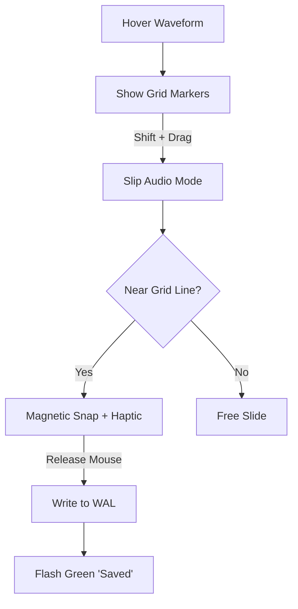
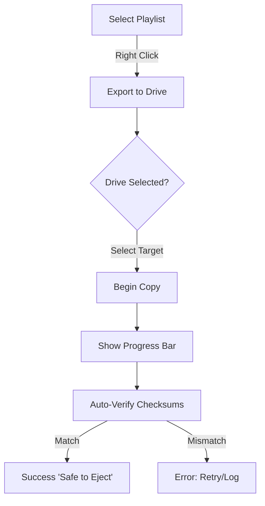

# UX Design Specification meta-dj

**Author:** GeoloeG
**Date:** 2026-01-15

---

## Executive Summary

### Project Vision
To create `meta-dj`, a professional-grade, browser-based DJ ecosystem that replicates the industry-standard Engine DJ desktop software 1:1. By leveraging cutting-edge web technologies (WASM, OPFS, WebHID), it decouples the professional library management workflow from specific operating systems, offering a "cloud-based" but "local-execution" tool for touring professionals to manage their music and perform with hardware parity.

### Target Users
*   **The Touring Professional:** Logistics-focused, reliability-obsessed. Needs to manage their database (m.db) and export to drives from any computer, anywhere.
*   **The Hardware Purist:** Values muscle memory. Expects the software to feel exactly like their Denon/Numark hardware OS. High-contrast, touch-optimized, no distractions.

### Key Design Challenges
*   **Browser Containment (App-Like Feel):** Preventing standard browser behaviors (scrolling, zooming, back-swipe) from breaking the immersion or causing accidental exits.
*   **Visual Precision & Latency:** Rendering 60fps+ visualizations (waveforms) via WebGL to match native performance perception.
*   **Data Density vs. Performance:** Virtualizing massive track lists (50k+ songs) and complex nested trees while maintaining instant scroll responsiveness.
*   **Hardware Parity:** Designing UI elements (knobs, faders) that map 1:1 to physical hardware controls for seamless web-to-device transition.

### Design Opportunities
*   **"Zero-Install" Professionalism:** Creating an onboarding experience that feels instant yet robust.
*   **Visualizing the Invisible:** Better visualization of database relationships (e.g., smart list logic) than native apps.
*   **Seamless Hardware Bridge:** Making the "Sync Manager" process visually transparent and less intimidating than file-system operations.

## Core User Experience

### Defining Experience
The core workflow is a rigid professional loop: **Ingest (WebFS) -> Analyze (WASM/AI) -> Refine (Cues/Grids) -> Export (Sync Manager)**. This is not a casual listening tool; it is a mission-critical preparation environment. The user must feel absolute confidence that the data they see in the browser is exactly what will appear on their hardware stage.

### Platform Strategy
*   **Target:** Chromium-based Desktop Browsers (Chrome/Edge) exclusively.
*   **Technologies:** Heavy dependency on WebHID, WebMIDI, and File System Access API.
*   **Offline First:** Must use **Service Workers** to cache the entire application shell, ensuring full functionality at venues with no internet.
*   **Constraint:** Mobile/Tablet support is explicitly out of scope for Phase 1.

### Effortless Interactions
*   **Instant Mount:** Opening a local `m.db` database must be near-instantaneous, leveraging SQLite WASM/OPFS.
*   **Plug & Play Hardware:** Connecting a Denon player via USB should trigger an immediate "Device Detected" state via WebHID.
*   **Trust-based Export:** The USB export process must include an **Auto-Verification** step, visually confirming distinct checksums so the user has zero anxiety about data corruption.
*   **Infinite Scroll:** Navigating 50,000 tracks must use **DOM Virtualization** to ensure 60fps scrolling, regardless of library size.

### Critical Success Moments
*   **The "Trust" Verification:** The moment the user re-loads the page and sees their library exactly as they left it (proving OPFS persistence works).
*   **The Hardware Handshake:** The first time a user plugs an exported USB into a physical player and it loads successfully.

### Experience Principles
1.  **Data Integrity > UI Flair:** Never sacrifice database safety for animations.
2.  **Hardware Fidelity:** The UI must mimic the hardware OS 1:1 to respect muscle memory.
3.  **Invisible Technology:** The complex web stack (WASM, OPFS) must remain completely invisible to the user.

## Desired Emotional Response

### Primary Emotional Goals
*   **Absolute Confidence:** The user must trust the application implicitly. Every interaction must reinforce stability, data integrity, and precision. "The browser feels like a cockpit, not a webpage."
*   **Professional Flow:** The tool should disappear. Complex tasks (beatgrid editing, playlist management) must be executed with such low latency and high precision that the user enters a state of flow, forgetting the technology stack.

### Emotional Journey Mapping
1.  **Skepticism (Entry):** "Can a browser really handle my massive library?"
2.  **Surprise (Ingest):** "Wow, it mounted instantly. It feels native."
3.  **Focus (Performance/Prep):** "I'm just working. No lag, no glitches."
4.  **Relief (Export):** "checksum matched. I'm safe to go on stage."

### Micro-Emotions
*   **Relief vs. Anxiety:** Explicit "Saved to Disk" notifications to counter the "did the browser just crash?" anxiety.
*   **Power vs. Toy:** Dense, high-contrast data visualization signals "Pro Tool," avoiding the whitespace-heavy designs of consumer web apps.

### Design Implications
*   **Stability Indicators:** Always show the database connection status (e.g., "OPFS: Connected | WAL Active").
*   **Destructive Confirmation:** "Red Zone" warnings for any action that alters the `m.db` permanently, requiring deliberate confirmation.
*   **Visual Feedback:** Every click, tap, and drag must have immediate (<16ms) visual feedback (active states) to confirm the system has registered the intent.

### Emotional Design Principles
*   **No "Maybe":** The UI never guesses. It knows. (e.g., Verify exports, don't just "finish").
*   **Dark & Sharp:** The aesthetic must be OLED-black and razor-sharp to convey precision and seriousness.

## UX Pattern Analysis & Inspiration

### Inspiring Products Analysis
*   **Engine DJ (Desktop):** The reference implementation. We will mirror its information hierarchy 1:1 to zero the learning curve for existing hardware users.
*   **Ableton Live:** The gold standard for "Single Screen Density." We draw inspiration from its flat, modal-free interface to manage complex parameters without hiding them.
*   **Linear / Superhuman:** Inspiration for "Web Speed." We adopt their philosophy of instant, optimistic UI updates and heavy keyboard shortcut reliance.

### Transferable UX Patterns (Native Reverse-Engineering)
*   **Virtual Windowing:** Adopting the "Infinite List" pattern to match the native app's ability to scroll 100,000 tracks at 60fps without DOM lag.
*   **Pointer Lock Controls:** Using "Pointer Lock" interactions for faders and knobs, decoupling the mouse position from the value to allow infinite precision (vs. standard web ranges).
*   **Isomorphic Context Menus:** Replacing the browser's "Right Click" entirely with a custom, DOM-based menu overlay that perfectly mimics the Engine DJ context menu hierarchy.
*   **Optimistic State Updates:** The UI must "lie" to the user, showing the "new state" (e.g. Hot Cue color) instantly, while the async database write happens in the background (Service Worker), masking the "web request" latency.

### Anti-Patterns to Avoid
*   **The "Web Modal":** Blocking alerts (confirmations) break immersion. We will use non-blocking status toasts or inline warnings.
*   **Scroll Jacking:** We will respect native scroll inertia and physics; manipulating it makes web apps feel "cheap."
*   **"Loading..." Spinners:** Instead of spinning circles, we will use skeleton screens or optimistic states to reduce perceived latency.

### Design Inspiration Strategy
*   **Adopt:** Engine DJ's Visual Language (Colors, Icons, Layout) to ensure immediate familiarity.
*   **Adapt:** VS Code / Linear's "Power User" keyboard workflows to make the browser experience faster than the native reference.
*   **Avoid:** Material Design ripples, drop-shadows, and "bubbly" UI trends that contradict the "Pro Audio" aesthetic.

## Design System Foundation

### Design System Choice
**Custom Hybrid Architecture:**
*   **Foundation:** **Tailwind CSS** for atomic, performance-first styling.
*   **Primitives:** **Headless UI** (or Radix UI) for unstyled, accessible functional components (Modals, Dialogs, Dropdowns).
*   **Components:** Bespoke React components for domain-specific UI (Knobs, Faders).
*   **Rendering:** **Hybrid Strategy** using React for standard UI and **Canvas/WebGL** for high-performance waveform rendering, keeping heavy visual processing off the main thread.

### Rationale for Selection
*   **Hardware Parity:** Standard libraries (MUI, AntD) enforce "Web" patterns (ripples, shadows) that clash with the flat, high-contrast "Engine OS" aesthetic. A custom Tailwind approach allows 1:1 visual replication.
*   **Performance:** Tailwind generates minimal CSS at build time, ensuring the app loads instantly, crucial for the "Native Feel."
*   **Interaction Control:** We need absolute control over DOM events for features like "pointer lock" on knobs; wrapping heavy library components would introduce unnecessary friction and overhead.

### Implementation Approach
*   **Atomic Design:** Build small primitives first (`<Knob />`, `<Fader />`, `<LedButton />`) that encapsulate both the visual style and the logic.
*   **Global Tokens:** Define strict color and typography tokens in `tailwind.config.js` that map directly to the Engine OS specifications.
*   **Strict Z-Scale:** Implement a centralized Z-index scale (e.g., `z-modal`, `z-tooltip`) in Tailwind config to manage the complex "Window Manager" nature of the app without conflicts.

### Customization Strategy
*   **Hardware-Sync Theming:** Use CSS variables mapped to application state to allow the UI to reflect hardware changes (e.g., Layer Color changes on the physical deck change the UI accent color instantly).
*   **Start Dark:** The default theme is "OLED Black" to match the hardware environment.

## 2. Core User Experience (Detailed Mechanics)

### 2.1 Defining Experience
**The "Surgical" Grid Edit:** The defining moment of trust relies on the user's ability to perfectly align an audio transient (kick drum) to the beatgrid. If this grid is wrong, the hardware sync fails. This interaction must feel clinically precise, transparent, and instant.

### 2.2 User Mental Model
*   **The Adjuster:** "I am moving the paper (audio) under the ruler (grid)."
*   **The Perfectionist:** "If this is 1 millisecond off, my mix will gallop."
*   **Expectation:** The metronome click must disappear completely behind the drum hit when aligned (Phase Cancellation check).

### 2.3 Success Criteria
*   **Visual Lock:** The Grid Marker line turns "Engine Green" to confirm snap-to-transient.
*   **Latency:** <16ms response to drag events. It must feel like physical paper moving.
*   **Audio Feedback:** Immediate re-triggering of the audio loop while interfering to verify the phase alignment.

### 2.4 Novel UX Patterns
*   **Slip-Under Editing:** Unlike standard text/audio editors where you move the cursor, here the cursor (center playhead) remains improved static, and the *audio waveform* moves. This mimics the physical rotation of a DJ deck platter.
*   **Pointer Lock Infinite Drag:** When dragging values (BPM, Offset), the mouse cursor locks in place (disappears), allowing infinite adjustment range without hitting the screen edge.

### 2.5 Experience Mechanics
1.  **Initiation:** Hovering the waveform instantly reveals the Grid Markers. No "Edit Mode" button required; the mouse proximity *is* the mode switch.
2.  **Interaction:** `Shift + Drag` initiates the "Slip" mode. The waveform follows the mouse 1:1.
3.  **Feedback:** As the user drags, the transient "Snaps" magnet-like to the quarter-note grid lines with a localized haptic bump (visual shake).
4.  **Completion:** Releasing the mouse immediately saves the new offset to the `m.db` (WAL mode) and flashes a subtle "Saved" toast in the footer.

## Visual Design Foundation

### Color System
**Engine OS Palette (OLED Optimized):**
*   **Backgrounds:** `OLED Black (#000000)` implies "Hardware Mode" and infinite contrast. `Surface Dark (#121212)` is used for panels to differentiate from the void.
*   **Primary Accent:** `Engine Green (#4DFA90)` represents "Active/Live" states (Play, Sync, Valid Grid).
*   **Secondary:** `Denon Blue (#2E8CFF)` is used exclusively for Library Navigation and Crates.
*   **Semantic:** `Error Red (#FF3B30)` for destructive actions or phase errors. `Warning Yellow (#FFCC00)` for sync drifts.

### Typography System
**Font Family: Inter (Google Fonts)**
*   **Rationale:** Chosen for its extremely high legibility on high-density displays and neutral "system" feel that mirrors embedded OS fonts.
*   **Weights:**
    *   **Bold (700):** Used for all Data Values (BPM, Time, Loop Length).
    *   **Regular (400):** Used for Labels (Title, Artist, Settings).
*   **Features:** `tabular-nums` is globally enforced for all numeric displays to prevent jitter during playback.

### Spacing & Layout Foundation
**The "Cockpit" Density:**
*   **Grid:** Strict **4px Baseline Grid** to align with hardware rendering standards.
*   **Density:** Ultra-High. We minimize whitespace to maximize data visibility (e.g., 50 tracks visible on a 4K screen).
*   **Touch Targets:**
    *   **Performance:** Minimum 44px (Play, Cue) for reliable hitting.
    *   **Management:** Condensed 32px rows for Library Management (mouse/trackpad optimized).

### Accessibility Considerations
*   **Contrast:** The #000000/#4DFA90 pairing exceeds AAA contrast requirements, ensuring visibility in dark club environments.
*   **Focus States:** "Engine Green" outline rings (2px) on all focused elements to support full keyboard navigation without mouse reliance.

## Design Direction Decision

### Design Directions Explored
We focused on a single authoritative direction: **"The Engine OS Reference"**. Given the strict "1:1 Hardware Parity" requirement, exploring unrelated visual styles (e.g., "Soft Web", "Neumorphism") would be counter-productive. The design process focused on reverse-engineering the existing hardware aesthetic for the web context.

### Chosen Direction
**"The Engine OS Reference" (Hardware Parity)**

### Design Rationale
*   **Zero Learning Curve:** Existing Denon DJ users must feel instantly at home. Any deviation causes friction.
*   **Performance First:** The flat, high-contrast design (no shadows, blurs) is computationally cheap, leaving GPU headroom for the 60fps waveform rendering.
*   **Environment Optimization:** The OLED Black palette is specifically designed for dark club environments, minimizing screen glare while maximizing data legibility.

### Implementation Approach
*   **Strict Adherence:** We will use the HTML/Tailwind mockup (`ux-design-directions.html`) as the living specification.
*   **Pixel-Perfect Primitives:** Components will be built to match the dimensions and spacing of the physical screen counterparts (e.g., 44px minimum touch targets).

## User Journey Flows

### 1. Library Ingest (The "Zero-Install" Promise)
**Goal:** Mount a local folder and see 50k tracks instantly via OPFS, mimicking a native desktop app install without the wait.

```mermaid
graph TD
    A[Landing Page] -->|Drag & Drop Folder| B{Permission?}
    B -->|Deny| C[Show Explanation Toast]
    B -->|Allow| D[Scan File System]
    D --> E{SQLite DB Exists?}
    E -->|No| F[Import Metadata to OPFS]
    E -->|Yes| G[Fast Hydrate from OPFS]
    F --> H[Virtual List render (Wait <1s)]
    G --> H
    H --> I[Ready State]
```

### 2. Grid Editing (The "Surgical" XP)
**Goal:** Perfectly align an audio transient to the beatgrid using the "Slip-Under" mechanic defined in the Core Experience.



### 3. USB Export (The "Stage-Ready" Trust)
**Goal:** Export a playlist to a physical USB drive with cryptographic certainty that it will work on stage.



### Journey Patterns
*   **Contextual Actions:** "Right-click everywhere." Almost all rigorous actions (Export, Analyze, Delete) live in context menus, not visible ribbons.
*   **Optimistic Persistence:** Every small action (cue point set, grid move) saves instantly to the database without a manual "Save" button.
*   **Non-Blocking Status:** Heavy operations (Exports, Analysis) always happen in background threads (Web Workers) with non-modal toasts, never blocking the UI.

## Component Strategy

### Design System Components (The "Standard" Layer)
**Source: Headless UI (Unstyled Primitives)**
*   **Dialogs:** Used for Global Settings and Export Confirmations. Styled with a unified "Glass Panel" backdrop.
*   **Popovers:** Used for the Complex Context Menus. Must support nesting (Sub-menus).
*   **Listboxes:** Used for simple selection inputs (Quantize Value, Sort Order).

### Custom Components (The "Atomic Audio" Layer)
Standard web libraries lack pro-audio controls. We will build these from scratch:

**1. `<WaveformCanvas />`**
*   **Purpose:** High-performance, 60fps rendering of audio analysis data.
*   **Tech:** Hybrid Canvas 2D (visuals) + React (interaction layer).
*   **Interaction:** Supports "Slip" (Shift+Drag), Pinch-to-Zoom, and Scrubbing.
*   **States:** `Loading` (Skeleton), `Analyzed` (Full Color), `SlipMode` (Ghosted).

**2. `<RotaryKnob />` (Infinite Control)**
*   **Purpose:** Precision control for EQ, Gain, and Parameters.
*   **Tech:** **Pointer Lock API**. This allows the user to drag infinitely up/down without the cursor hitting the screen edge.
*   **Visual:** SVG-based ring indicator using the computed `Engine Green` value.

**3. `<VirtualTrackList />`**
*   **Purpose:** Scrolling 100,000 tracks with zero DOM lag.
*   **Tech:** Virtual Windowing (e.g., TanStack Virtual).
*   **Features:** Draggable Column Headers, "Tabular Nums" font alignment, Keyboard Navigation (Arrow Keys).

### Implementation Roadmap
**Phase 1: Core Visualization (Read-Only)**
*   Build `VirtualTrackList` and `WaveformCanvas`.
*   Goal: User can see their library and tracks, but can't edit yet.

**Phase 2: Interaction Layer (Control)**
*   Build `RotaryKnob`, `Fader`, and Context Menus.
*   Goal: User can manipulate the data.

**Phase 3: Polish & Overlay**
*   Build Modals, Settings, and Toast Notifications.
*   Goal: Complete the application shell.

## UX Consistency Patterns

### Input Strategy: "No Visible Inputs"
*   **Rule:** The main interface MUST NOT show persistent search bars or text inputs that could steal keyboard focus.
*   **Behavior:** Typing anywhere triggers the "Type-Ahead" search filter on the active list. Renaming is triggered via specific contexts (Double Click).
*   **Rationale:** Preventing "Focus Trap." In a DJ app, the Spacebar must ALWAYS toggle playback, never type a space character in a forgotten search box.

### Focus Strategy: "Active Ring"
*   **Rule:** The currently controlled panel (Deck A, Deck B, Library) implies a strict "Active Context," visualized by a 2px `Engine Green` border.
*   **Behavior:** Hardware commands (Rotary Encoder turns) are routed ONLY to the Active Panel.
*   **Accessibility:** This doubles as the keyboard navigation focus indicator.

### Safety Strategy: "Hold-to-Confirm"
*   **Rule:** Destructive actions (Eject Drive, Delete Track) never use blocking "Are you sure?" modals.
*   **Behavior:** Buttons require a **1.5s Long Press** to execute, with a filling circular progress indicator.
*   **Rationale:** Modals block the UI and can be dismissed by reflex. Long-press requires deliberate, conscious intent.

### Action Hierarchy: Context Menus > Ribbons
*   **Rule:** Only critical performance controls (Play, Cue, Loop) have visible buttons.
*   **Behavior:** All management tasks (Analyze, Rate, Export, Tag) are hidden inside Right-Click Context Menus.
*   **Rationale:** Preserves the "Cockpit" density. 90% of the screen is for reading data, not identifying buttons.

## Responsive Design & Accessibility

### Responsive Strategy: "Desktop Only"
*   **Constraint:** The application does **NOT** support mobile phones for core workflows. The density of data (50k tracks) and precision of controls (1ms grid edits) requires a minimum desktop footprint.
*   **Behavior:**
    *   **< 1024px:** Displays a "Please use a Desktop Browser" landing page with a feature summary.
    *   **> 1024px:** Elastic Layout. The Waveform and Library List expand to fill available width. Vertical height is prioritized for the Library (more visible tracks).

### Breakpoint Strategy
*   **1024px (Tablet Landscape / Laptop):** Minimum supported width. Two-Deck Vertical Layout.
*   **1440px (Desktop):** Standard Layout.
*   **2560px (Ultrawide):** "Wide Deck" Mode. Waveforms stretch horizontally for maximum grid precision.

### Accessibility Implementation: "Keyboard is King"
*   **Primary Goal:** A professional DJ must be able to perform a full set without touching the mouse.
*   **Key Mapping:**
    *   `Space`: Play/Pause Active Deck.
    *   `Enter`: Load Track to Active Deck.
    *   `Shift + Left/Right`: Nudge Beatgrid (1ms).
    *   `Ctrl + F`: Jump to Search.
*   **Compliance:** WCAG 2.1 AA.
    *   *High Contrast Mode:* Supported natively by the customized `OLED Black` theme.
    *   *Focus Indicators:* The "Engine Green" active ring is the primary focus indicator.

### Testing Strategy
*   **Hardware Lab:** Test on 13" MacBook Air (Low Res) and 27" 4K Monitor (High DPI) to ensure 60fps canvas performance on both.
*   **Input Testing:** Full regression test of all features using ONLY a keyboard.

<!-- UX design content will be appended sequentially through collaborative workflow steps -->
